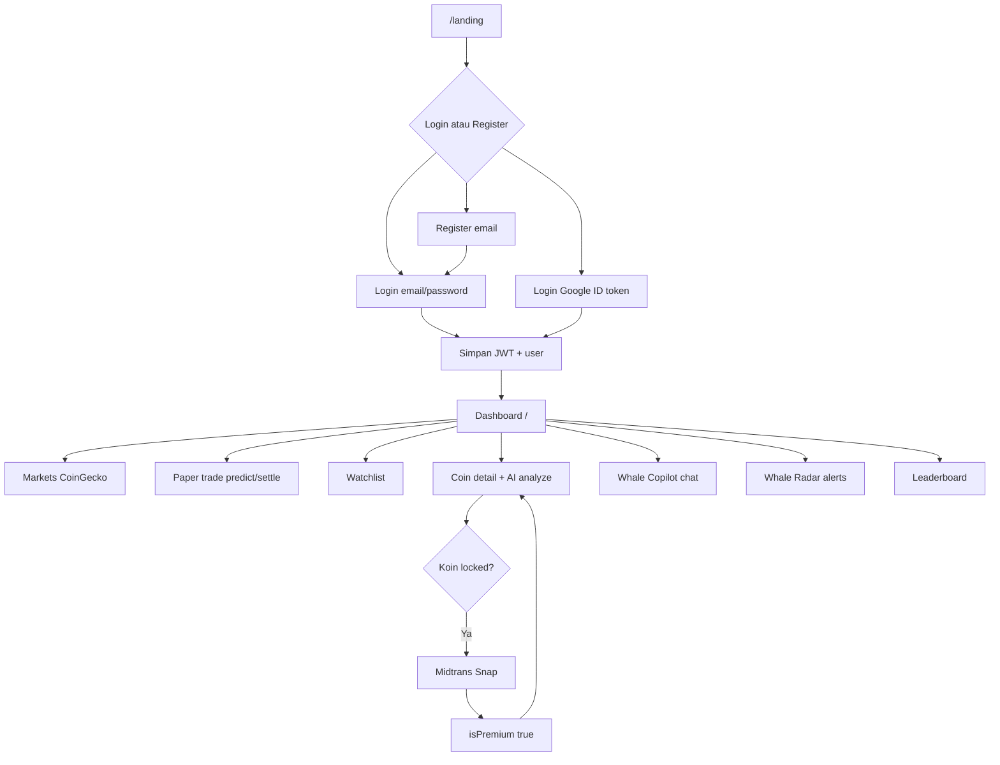

# WhaleWatch AI


Platform intelijen pasar kripto berbasis AI: pantau harga live, analisis sentimen & rekomendasi, deteksi pergerakan “whale”, paper trading gamifikasi, serta upgrade premium via Midtrans.

> Monorepo Individual Project — frontend di `clien/`, backend di `servis/WhaleWatchAi_Backend/`.

---

## Daftar isi

- [Tentang aplikasi](#tentang-aplikasi)
- [Tech stack](#tech-stack)
- [Struktur proyek](#struktur-proyek)
- [Fitur lengkap](#fitur-lengkap)
- [Alur aplikasi](#alur-aplikasi)
- [API overview](#api-overview)
- [Menjalankan lokal](#menjalankan-lokal)
- [Environment variables](#environment-variables)
- [Deploy](#deploy)

---

## Tentang aplikasi

**WhaleWatch AI** membantu trader ritel membaca pasar kripto lebih cepat dengan kombinasi:

- data pasar real-time dari **CoinGecko**
- analisis AI via **Groq (Llama 3.1)**
- berita terkait dari RSS **Cointelegraph**
- simulasi trading (virtual cash) + leaderboard
- akses premium (analisis AI semua koin, deep-dive) melalui **Midtrans Snap**

Target pengguna: mobile-first (mayoritas akses dari HP), dengan layout desktop yang tetap lengkap (sidebar, tabel pasar, panel Copilot).

---

## Tech stack

### Frontend (`clien/`)

| Area | Teknologi |
|------|-----------|
| Framework | React 19 |
| Build | Vite 8 |
| Routing | React Router 8 |
| State | Redux Toolkit + React Redux |
| Styling | Tailwind CSS 4 |
| Animasi | Motion |
| Ikon | Lucide React |
| Chart | Recharts |
| HTTP | Axios |
| OAuth Google | `@react-oauth/google` |
| Deploy FE | Vercel (SPA rewrite) |

### Backend (`servis/WhaleWatchAi_Backend/`)

| Area | Teknologi |
|------|-----------|
| Runtime | Node.js (CommonJS) |
| Framework | Express 5 |
| ORM / DB | Sequelize + PostgreSQL (`pg`) |
| Auth | JWT (`jsonwebtoken`), bcryptjs, Google Auth Library |
| AI | Groq SDK (`llama-3.1-8b-instant`) |
| Market data | CoinGecko API (Axios) |
| Berita | `rss-parser` (Cointelegraph) |
| Pembayaran | Midtrans Client (Snap sandbox) |
| Dokumentasi API | Swagger UI (`/api-docs`) |
| Validasi | Zod (di dependency) |

---

## Struktur proyek

```text
Individual_Project/
├── clien/                              # Frontend React (Vite)
│   ├── src/
│   │   ├── pages/                      # Landing, Login, Register, Dashboard, …
│   │   ├── components/                 # Layout, Copilot, Radar, CryptoRow, …
│   │   ├── store/                      # Redux slices (auth, crypto, watchlist)
│   │   └── utils/api.js                # Axios baseURL → backend
│   ├── public/favicon.svg
│   ├── vercel.json
│   └── package.json
└── servis/
    └── WhaleWatchAi_Backend/           # Backend Express
        ├── bin/www.js                  # Entry (PORT || 3000)
        ├── app.js
        ├── routes/                     # auth, coins, ai, watchlist, payment, game
        ├── controllers/
        ├── models/                     # User, Watchlist, ActiveTrade
        ├── migrations/ & seeders/
        ├── middlewares/                # auth JWT, errorHandler, bcrypt, jwt
        └── .env.example
```

---

## Fitur lengkap

### 1. Autentikasi

#### Register (email/password)

- Form: username, email, password (min. 8), avatar URL opsional.
- Backend: `POST /api/auth/register` → Sequelize `User.create`.
- Password di-hash (bcrypt) lewat hook model sebelum disimpan.
- Setelah sukses, user diarahkan ke halaman login (belum auto-login).

#### Login manual

- Form email + password → `POST /api/auth/login`.
- Validasi kredensial → JWT (`access_token`) + objek `user` (id, username, email, avatar, `isPremium`).
- Frontend menyimpan token & user di `localStorage` + Redux (`setAuthSuccess`).
- Redirect ke dashboard `/`.

#### Login Google

1. Tombol Google Sign-In (`@react-oauth/google`) di halaman Login.
2. SDK Google mengembalikan **ID token** (`credential`).
3. Frontend kirim `POST /api/auth/login-google` dengan header:
   - `access-token-google: <credential>`
4. Backend memverifikasi token lewat `google-auth-library` dengan audience `GOOGLE_CLIENT_ID`.
5. Email harus terverifikasi Google.
6. `User.findOrCreate` berdasarkan email (password acak untuk memenuhi validasi model).
7. Response sama dengan login manual: JWT + data user.

> [!NOTE]
> Di Google Cloud Console, tambahkan Authorized JavaScript origins untuk lokal (mis. `http://localhost:5173`) dan domain produksi Vercel.

#### Proteksi rute

- **`ProtectedRoute`**: halaman app (dashboard, detail, dll.) hanya untuk user login.
- **`GuestRoute`**: `/login` & `/register` tidak bisa dibuka ulang jika sudah login (redirect ke `/`).
- Logout hanya di **sidebar** (navbar menampilkan profil saja).

---

### 2. Landing page (`/landing`)

Halaman publik marketing: value proposition AI + whale radar, daftar fitur, perbandingan Free vs Whale Pro, CTA daftar/login.

---

### 3. Dashboard Radar Pasar (`/`)

- Ticker harga live (marquee).
- Widget **paper trading** (gauge + terminal feed).
- Daftar pasar CoinGecko:
  - **Mobile**: kartu vertikal (nama, harga, % 24j, pantau).
  - **Desktop**: tabel lengkap (#, aset, harga, perubahan, kategori, aksi).
- Tambah koin ke watchlist dari list pasar.
- Data: `GET /api/coins/markets` (cache ~45 detik di backend; filter kategori layer1/layer2/meme/ai).

---

### 4. Paper trading & gamifikasi

Setiap user punya saldo virtual default (**$5.000**), XP, dan level.

| Aksi | Endpoint | Perilaku |
|------|----------|----------|
| Pasang prediksi | `POST /api/game/predict` | PUMP/DUMP pada koin; butuh saldo ≥ 300; hanya 1 trade `PENDING` |
| Settle | `POST /api/game/settle` | Bandingkan harga; menang +$500 / +15 XP; kalah −$300 |
| Leaderboard | `GET /api/game/leaderboard` | Top trader by cash/level + badge |
| Riwayat | `GET /api/game/history` | 30 trade terakhir user |

Badge contoh: Cyber Dolphin, Market Shark, Whale Lord, Apex Titan.

Halaman UI: `/leaderboard` (tab ranking + riwayat pribadi).

---

### 5. Detail koin (`/coin/:coinId`)

1. `GET /api/coins/detail/:id` — metrik pasar, deskripsi, data developer (opsional GitHub).
2. `GET /api/coins/chart/:id` — chart harga (timeframe 12j–7h); fallback sample jika chart gagal.
3. `GET /api/ai/analyze/:id` (butuh JWT) — rekomendasi **BUY / HOLD / SELL**, sentimen, ringkasan analisis; user premium mendapat `premium_deep_dive`.
4. Tab UI: Overview (grafik + AI), Fundamental, Kode & berita.

**Gate premium:** user gratis hanya bisa analisis AI penuh untuk **Bitcoin** & **Ethereum**; koin lain terkunci → CTA upgrade.

> [!TIP]
> Kegagalan panel AI tidak lagi merusak seluruh halaman detail; data pasar tetap ditampilkan.

---

### 6. Watchlist (`/watchlist`)

- CRUD pantauan koin (auth wajib).
- Edit catatan per item.
- **Portfolio Audit AI**: kirim daftar koin → `POST /api/ai/portfolio-audit` → risk score, kategori risiko, ringkasan, rekomendasi.

---

### 7. Whale Copilot (chatbot floating)

- Komponen global di layout terproteksi.
- `POST /api/ai/chat` dengan `{ message, history }`.
- Model: Groq Llama 3.1; jawaban Bahasa Indonesia, fokus crypto/trading.
- **Mobile**: full-screen sheet; **Desktop**: panel floating ~420×560.

---

### 8. Whale Radar (modal)

- Tombol **RADAR** di navbar.
- `GET /api/ai/whale-alerts` — feed alert transfer besar (data agregat/mock dengan sinyal AI).
- Menampilkan asal/tujuan, nilai, risk level, dan interpretasi.

---

### 9. Upgrade Premium (`/upgrade`)

1. User klik upgrade → `POST /api/payment/initiate` (auth).
2. Backend membuat transaksi Midtrans Snap (sandbox), mengembalikan `snapToken`.
3. Frontend memanggil `window.snap.pay(snapToken)` (script di `index.html`).
4. Webhook Midtrans `POST /api/payment/notification` → set `user.isPremium = true`.
5. Redux `updatePremiumStatus(true)` membuka fitur AI terkunci.

Manfaat Pro (ringkas):

- Analisis AI semua koin
- Deep-dive psikologis pasar
- Akses penuh Whale Radar / fitur premium terkait
- Badge PRO di leaderboard

---

### 10. Informasi & panduan (`/info`)

Halaman panduan penggunaan platform di dalam app.

---

## Alur aplikasi



### Ringkasan sesi

1. User masuk (manual / Google) → JWT di `Authorization: Bearer …`.
2. Shell `MainLayout`: Sidebar + Navbar + Copilot + Radar modal.
3. Dashboard memuat pasar & status game; user bisa prediksi PUMP/DUMP.
4. Dari list → detail koin → AI analyze (atau upgrade jika terkunci).
5. Watchlist + audit portofolio; leaderboard untuk kompetisi virtual cash.
6. Logout dari sidebar membersihkan `localStorage` + Redux.

---

## API overview

Base URL lokal: `http://localhost:3000`  
Swagger: `http://localhost:3000/api-docs`

| Prefix | Auth | Ringkasan |
|--------|------|-----------|
| `/api/auth` | campuran | register, login, login-google, profile |
| `/api/coins` | publik | markets, detail, chart |
| `/api/watchlist` | JWT | CRUD + notes |
| `/api/ai` | JWT | analyze, chat, whale-alerts, portfolio-audit |
| `/api/game` | JWT | predict, settle, leaderboard, history |
| `/api/payment` | JWT + webhook | initiate Snap, notification Midtrans |

---

## Menjalankan lokal

### Prasyarat

- Node.js (disarankan LTS)
- PostgreSQL
- Akun/API key: Google OAuth (opsional untuk Google login), CoinGecko, Groq, Midtrans sandbox

### Backend

```bash
cd servis/WhaleWatchAi_Backend
cp .env.example .env
# isi DB_*, JWT_SECRET, GOOGLE_CLIENT_ID, COINGECKO_API_KEY, GROQ_API_KEY, MIDTRANS_*

npm install
npx sequelize-cli db:migrate
# opsional: npx sequelize-cli db:seed:all

npm run dev
# → http://localhost:3000
```

### Frontend

```bash
cd clien
npm install
npm run dev
# → http://localhost:5173 (default Vite)
```

Pastikan `clien/src/utils/api.js` mengarah ke backend lokal:

```js
baseURL: "http://localhost:3000"
```

---

## Environment variables

File acuan: [`servis/WhaleWatchAi_Backend/.env.example`](servis/WhaleWatchAi_Backend/.env.example)

| Variabel | Dipakai untuk |
|----------|----------------|
| `DB_USERNAME`, `DB_PASSWORD`, `DB_NAME`, `DB_HOST` | PostgreSQL development/test |
| `DATABASE_URL` | PostgreSQL production (Sequelize) |
| `NODE_ENV` | `production` di Railway (opsional jika Railway auto-detect) |
| `PORT` | Port server (default 3000) |
| `JWT_SECRET` | Sign & verify access token |
| `GOOGLE_CLIENT_ID` | Verifikasi Google ID token (harus sama dengan clientId di frontend) |
| `COINGECKO_API_KEY` | Header CoinGecko demo API |
| `GROQ_API_KEY` | Chatbot, analyze, portfolio audit |
| `GROQ_MODEL` | Model Groq (default: `openai/gpt-oss-20b`) |
| `MIDTRANS_MERCHANT_ID` | Midtrans |
| `MIDTRANS_CLIENT_KEY` | Midtrans (frontend Snap + backend) |
| `MIDTRANS_SERVER_KEY` | Midtrans server / webhook |

> [!IMPORTANT]
> Jangan commit file `.env` yang berisi secret. Frontend saat ini menyimpan `baseURL` API dan Google client ID di source — ganti ke URL backend produksi sebelum deploy publik.

---

## Deploy

### Frontend (Vercel)

- Root / project: folder `clien`
- Build: `npm run build`, output `dist`
- `vercel.json` sudah mengatur rewrite SPA ke `index.html`
- Setelah backend live, update `baseURL` di `utils/api.js` (atau env Vite jika Anda tambahkan nanti)
- Samakan Google OAuth origins & Midtrans client key dengan environment produksi/sandbox yang dipakai

### Backend (Railway)

Monorepo: backend ada di `server/` (tidak ada app Node di root sebelum safety-net `package.json`).

**Wajib di Railway dashboard:**

1. **Root Directory** = `server` (Settings → Root Directory). Ini yang paling penting.
2. Tambah **Postgres** plugin di project yang sama; pastikan `DATABASE_URL` berasal dari Railway Postgres (bukan URL Supabase yang sudah mati).
3. Variables web service: `DATABASE_URL`, `JWT_SECRET`, `GOOGLE_CLIENT_ID`, `GROQ_API_KEY`, `COINGECKO_API_KEY`, Midtrans keys. `NODE_ENV=production` disarankan.
4. **Hapus / jangan share `PORT` dari Postgres** ke web service. `PORT=5432` membuat healthcheck gagal karena app listen di port DB, bukan port HTTP Railway.
5. `GOOGLE_CLIENT_SECRET` **tidak diperlukan** (backend verify Google ID token dengan `GOOGLE_CLIENT_ID` saja).
6. Setelah push kode baru: Deployments → pastikan deploy **SUCCESS** (bukan hanya Service Online dari deploy lama).
7. Verifikasi: `GET /health` → 200; `GET /ready` → db connected; `POST /api/auth/register` tidak 500.

`npm start` = migrate (`scripts/migrate.js`) lalu `bin/www.js`. Jika migrate gagal, proses exit → healthcheck `/health` gagal → deploy **FAILED**, sementara container lama tetap Online.

- Migration otomatis saat `npm start`
- Manual migrate: `npm run migrate` di folder `server/`
- CORS sudah dikonfigurasi untuk origin request browser
- Pastikan webhook Midtrans mengarah ke `https://<domain-api>/api/payment/notification`

### Google OAuth (Google Cloud Console)

- Authorized JavaScript origins: `https://clien-five.vercel.app` (+ `http://localhost:5173` untuk dev)
- Authorized redirect URIs jika dipakai: sama domain Vercel
- Client ID di Vercel/`VITE_GOOGLE_CLIENT_ID` **harus sama** dengan `GOOGLE_CLIENT_ID` di Railway

### Checklist pasca-deploy

- [ ] Deploy terbaru di Railway = Success (bukan Failed)
- [ ] `GET https://<api>/health` = 200
- [ ] `POST /api/auth/register` & `/login` berhasil (bukan 500)
- [ ] Google login (`POST /api/auth/login-google`) — origin & client ID cocok
- [ ] `GET /api/coins/markets` & detail bitcoin
- [ ] `POST /api/ai/chat` dengan Bearer token
- [ ] Snap Midtrans sandbox terbuka dari `/upgrade`

---

## Catatan arsitektur singkat

| Keputusan | Alasan |
|-----------|--------|
| JWT di `localStorage` | Sederhana untuk SPA; dilindungi route client + middleware server |
| AI hanya di Groq | Latency & JSON mode untuk analyze/audit |
| CoinGecko + cache singkat | Kurangi rate limit |
| Free vs Pro di level fitur AI | Monetisasi Midtrans tanpa memblokir market data publik |
| Mobile card / desktop table | UX untuk ~85% traffic mobile tanpa mengorbankan desktop |

---

Dibangun sebagai Individual Project Phase 2 — **WhaleWatch AI**.
